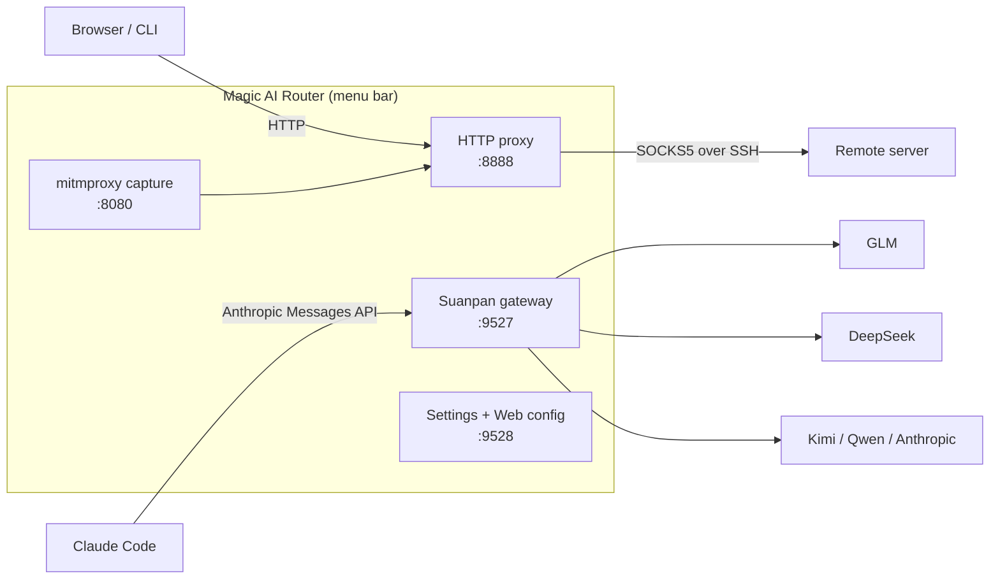

# Magic AI Router

**A macOS menu bar app that combines an SSH tunnel proxy, a TLS traffic capture tool, and an AI routing gateway (LLM router) — all in one status icon.**

[English](README.md) · [简体中文](README.zh-CN.md)


Magic AI Router packs three tools into a single native `.app`:

1. **Magic Proxy** — an SSH tunnel proxy. Start a local HTTP proxy (`:8888`) that forwards traffic through an SSH connection (`ssh -D` SOCKS5) to your remote server. Multi-tunnel, key or password auth, system-proxy management, auto-reconnect on wake/network change.
2. **AI Capture** — a TLS capture mode built on mitmproxy. Decrypt HTTPS in real time and log AI API requests/responses (OpenAI, Anthropic, DeepSeek, Doubao, Qwen, MiniMax) to JSONL — see exactly what your AI apps send and what they cost.
3. **Suanpan (算盘) AI Gateway** — a local LLM router that speaks the Anthropic Messages API (`:9527`). Point Claude Code (or any Anthropic-compatible client) at it and route requests to GLM, DeepSeek, Kimi, Qwen, or real Anthropic — switch models by rule, not by rewriting your workflow. Also deployable as a Docker container on Linux.

No Dock icon, no terminal windows, no config-file spelunking — it lives quietly in your menu bar.

---

## Why Magic AI Router

- **One tunnel, whole-system coverage.** Browsers and CLI tools speak plain HTTP to `127.0.0.1:8888`; the app transparently forwards through the SSH SOCKS5 tunnel to the remote end. Your traffic gets its own private lane.
- **See what your AI is saying.** TLS capture turns AI API calls into readable JSONL records — every prompt, every response, every token. No more black box.
- **One endpoint, many models.** Suanpan routes `claude-*` requests to the backend you choose per model prefix: `claude-sonnet → deepseek/v4-pro`, `claude-haiku → glm-5.2`… Change the rule, not your code.
- **Runs unattended.** Menu-bar resident (`LSUIElement` — no Dock icon), login-item launch, sleep prevention, wake-triggered reconnect, infinite retry with capped backoff.

## How it works

```
Browser / CLI ──HTTP :8888──▶ SOCKS5 :1080 ──SSH tunnel──▶ Remote server

Claude Code ──POST :9527/v1/messages──▶ Suanpan router ──▶ GLM / DeepSeek / Kimi / Anthropic …
```



## Feature highlights

### 🔗 Magic Proxy — SSH tunnel HTTP→SOCKS5 proxy

- Pure-Python asyncio HTTP proxy with per-request origin binding (keep-alive safe, CONNECT tunneling, chunked bodies)
- Multiple named tunnels, one-click switch from the menu
- Key auth (`ssh -i`) or password auth (via `sshpass`; password stored only in the macOS Keychain, injected through a pipe — never visible in `argv`/`ps`)
- Strict host-key policy with a dedicated `known_hosts` — new-server fingerprints require your explicit approval (TOFU with pinning)
- Auto-reconnect: retry backoff capped at 60 s and never gives up; wake events trigger an immediate reconnect (~5 s recovery instead of minutes)
- Optional transactional system-proxy management (`networksetup`) — your previous settings are restored on disconnect or crash
- Per-app proxy: launch Chromium apps (ChatGPT/Claude/Discord web) through `--proxy-server` without touching system settings

### 🔍 AI Capture — TLS traffic recorder

- One menu click starts a bundled mitmdump (`:8080`) cascaded into the proxy
- All HTTPS flows through it, but only known AI APIs are recorded to `~/.magic-proxy-captures/<date>.jsonl`; everything else passes through untouched
- Recognizes 6 providers out of the box: OpenAI, Anthropic, DeepSeek, Doubao (豆包), Qwen, MiniMax
- Guided root-CA trust flow on first use; capture retention days configurable

### 🧮 Suanpan — AI routing gateway (LLM router)

A FastAPI gateway that exposes the **Anthropic Messages API** on `:9527` and fans requests out to multiple LLM backends:

```bash
export ANTHROPIC_BASE_URL=http://127.0.0.1:9527
# Claude Code now goes through your routing rules
```

- **Providers** — any endpoint compatible with the Anthropic Messages API; API key inline, from environment variables, or custom auth headers
- **Model rules** — prefix matching: `claude-opus → GLM/glm-5.2`, `claude-sonnet → DeepSeek/deepseek-v4-pro`
- **Inline override** — a `provider/model` value in the model field (e.g. `KIMI/k3`) bypasses rules; the `<SUBAGENT-MODEL>` system-prompt tag does the same for subagents — cheap models for subagents, strong models for the main thread
- **Prompt-caching aware** — `anthropic_native` providers keep `cache_control` markers intact, so upstream prompt caches stay effective; the stats panel tracks cache hit rate
- **Streaming** — full SSE passthrough with usage extraction; safe retries only (non-idempotent requests are never replayed)
- **Usage & balance** — local JSONL usage log, today/7d/month/all aggregates by provider and route source, plus provider balance/quota panels
- **Claude Code sync** — a settings page maps Claude Code roles (main/subagent/plan…) to models and writes `~/.claude/settings.json` for you

Routing priority (first match wins):

| Priority | Mechanism | Example |
|---|---|---|
| 1 | Inline override (`provider/model` in model field) | `deepseek/deepseek-chat` |
| 2 | `<SUBAGENT-MODEL>` tag in system prompt | `<SUBAGENT-MODEL>KIMI/k3</SUBAGENT-MODEL>` |
| 3 | Prefix rule | `claude-sonnet* → DeepSeek/deepseek-v4-pro` |
| 4 | Default route | `router.default` |

If an explicit override points at an unknown/disabled provider, the request falls through to rules/default — loudly, with an `x-suanpan-fallback` response header, never silently misrouted.

### 🛡️ Security by design

- SSH passwords live in the macOS Keychain and reach `ssh` via a pipe (never in `argv`, `ps`, or config files)
- `StrictHostKeyChecking=yes` with an app-dedicated `known_hosts` — MITM attempts fail closed
- Gateway API-key checks use constant-time comparison; the config server binds to loopback by default and authenticates with a bearer token (HttpOnly session cookie for the settings UI)
- Outbound calls with credentials refuse cross-origin redirects and HTTPS→HTTP downgrades; responses capped at 1 MB
- Config writes are atomic (`0600`) with a journal for crash recovery; masked keys never leave the UI in plaintext

## Getting started

### macOS — download (recommended)

1. Grab the latest **`.dmg`** from [Releases](../../releases) (notarized — Gatekeeper won't complain)
2. Drag into `Applications`
3. Launch — a ⚫ icon appears in the menu bar

### macOS — run from source

```bash
git clone https://github.com/benz-ai-x/Magic-AI-Router.git
cd Magic-AI-Router
pip3 install -r requirements-dev.txt
python3 app.py
```

### macOS — build the `.app` yourself

Requires Python 3.12 on the build machine (mitmproxy ≥12 needs it; the app itself supports ≥3.9).

```bash
git clone https://github.com/benz-ai-x/Magic-AI-Router.git
cd Magic-AI-Router
bash build.sh
cp -R "dist/Magic AI Router.app" /Applications/
```

### Linux / headless — Docker (Suanpan gateway only)

No tunnel, capture, or GUI — just the AI routing gateway plus a web config page:

```bash
git clone https://github.com/benz-ai-x/Magic-AI-Router.git
cd Magic-AI-Router
bash docker/suanpan.sh up
```

- Gateway at `http://127.0.0.1:9527` (point Claude Code here)
- Web config at `http://127.0.0.1:9528` — log in with the token from `bash docker/suanpan.sh config-ui`
- One-command Claude Code hookup: `bash docker/suanpan.sh sync` (writes `~/.claude/settings.json`)
- Saving in the config page hot-reloads the running gateway; config and usage logs persist under `docker/data/`

Full deployment guide: [`docs/docker-deploy.md`](docs/docker-deploy.md).

### First run on macOS

1. Launch the app — the ⚫ menu-bar icon appears
2. Open **Preferences…** from the menu
3. Fill in SSH details under **Proxy → Tunnel** (key or password)
4. Click **Reconnect** in the menu
5. Point your browser's HTTP proxy at `127.0.0.1:8888` — you're through

Password auth needs `sshpass` once:

```bash
brew install hudochenkov/sshpass/sshpass
```

## Configuration

| File | Scope |
|---|---|
| `~/.magic-proxy.json` | Tunnels, proxy ports, capture settings, system options |
| `~/.suanpan.yaml` | Gateway: providers, routing rules, usage log (see [`docs/examples/suanpan.example.yaml`](docs/examples/suanpan.example.yaml)) |

Everything is also editable from the settings window (⌘,) — no hand-editing required:

| Group | Page | What you do there |
|---|---|---|
| Proxy | Tunnel | SSH connections, master-detail add/edit/remove |
| Proxy | Network | SOCKS5/HTTP ports, capture directory, retention days |
| System | System options | Sleep prevention, launch at login, set as system proxy |
| AI Routing | Providers | Backends and credentials (API key / env var / auth header) |
| AI Routing | Claude Code sync | Role→model mapping with default fallback, written into Claude Code |
| AI Routing | Usage stats | Today / 7-day / all-time usage, cache hit rate, route sources |
| AI Routing | Balance | Provider balances and plan quotas |

⌘S saves. Tunnel changes take effect via the menu's **Reconnect**.

Menu-bar status icon: 🟢 connected · 🟡 connecting · ⚫ stopped.

## 🤖 Agent-friendly

Magic AI Router ships first-class support for AI agents configuring it. While the app runs, open Preferences and click **“📋 Copy AI assistant instructions”**, then paste into Claude Code or any assistant — it learns the product, reads your live config, and sets things up for you.

Agents can also hit directly:

```
http://127.0.0.1:9528/agent.md      # product docs + API reference (no token)
http://127.0.0.1:9528/api/state     # current config (bearer token)
```

## Architecture

Pure Python (≥3.9; the packaging toolchain uses 3.12 for mitmproxy), no Node and no Electron — a rumps menu-bar shell hosting:

- `tunnel/` — asyncio HTTP→SOCKS5 proxy, SSH process lifecycle, retry/reconnect scheduling
- `capture/` — mitmdump subprocess, CA trust flow, AI-request extraction addon
- `suanpan/` — FastAPI gateway: routing, streaming proxy, usage logging, prewarm
- `services/` — config server (:9528), gateway runtime, Claude Code setup, lifecycle orchestration
- `mpconf/` / `sysctl/` / `shellui/` — config transactions, system integration, UI

Threads: main run loop (menu bar) + daemon threads for the asyncio proxy, uvicorn gateway, and config server. Deep-dive docs: [`CONTEXT.md`](CONTEXT.md) (domain glossary) and [`docs/adr/`](docs/adr/) (architecture decision records).

## Documentation

- [`CHANGELOG.md`](CHANGELOG.md) — release history
- [`docs/docker-deploy.md`](docs/docker-deploy.md) — Linux/Docker gateway deployment
- [`docs/adr/`](docs/adr/) — ADRs: system architecture, TLS capture, config masking, Claude Code env contract, prompt caching
- [`CONTEXT.md`](CONTEXT.md) — domain glossary

## License

[MIT](LICENSE) — Copyright (c) 2026 benz-ai-x

---

<div align="center">

**Magic AI Router** — the network, at your command

[Latest release](../../releases) · [Report an issue](../../issues)

</div>
