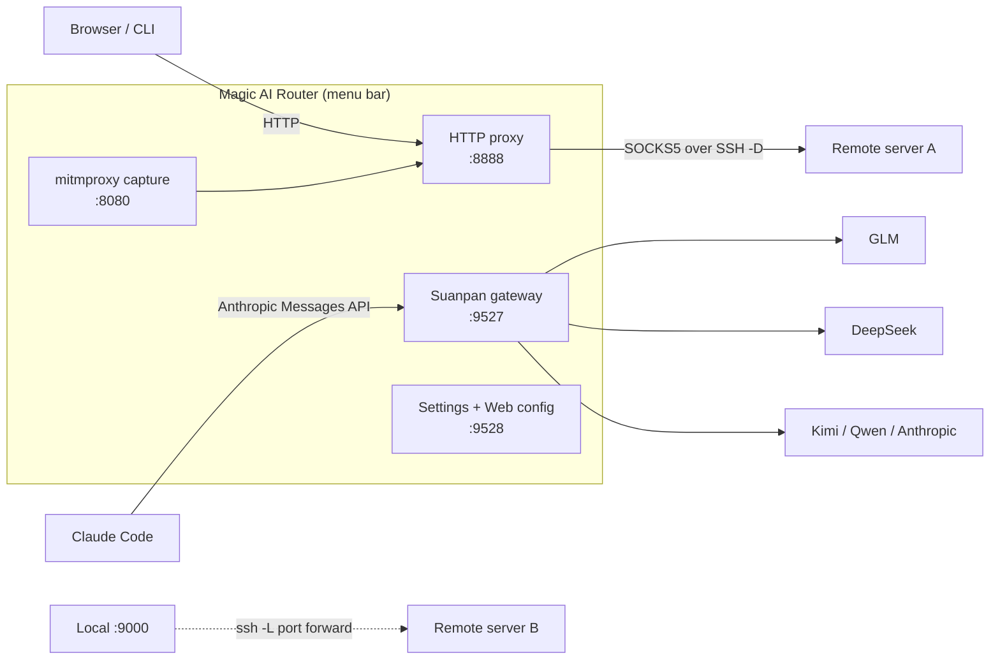

# Magic AI Router

**Route Claude Code to GLM, DeepSeek, or Kimi without touching your workflow — plus an SSH tunnel proxy with port forwarding and TLS capture of AI traffic, in one open-source macOS menu-bar app.**

[English](README.md) · [简体中文](README.zh-CN.md)

[](../../releases)
[](../../releases)
[](../../stargazers)


Magic AI Router packs **three tools** into a single native `.app` behind one status icon:

1. **🧮 Suanpan (算盘) — LLM routing gateway.** A local gateway that speaks the **Anthropic Messages API** (`:9527`). Point Claude Code or any Anthropic-compatible client at it, and route each request to the backend you choose — GLM (智谱), DeepSeek, Kimi (Moonshot), Qwen, or real Anthropic. Switch models by rule, not by rewriting your app. Also deployable as a Docker container on Linux.
2. **🔗 Magic Proxy — SSH tunnel proxy + port forwarding.** A local HTTP proxy (`:8888`) that forwards through your own server over SSH (`ssh -D` SOCKS5), plus `ssh -L` local port forwarding with **multiple tunnels running in parallel** — server A as your proxy, server B mapping remote ports to `127.0.0.1`, all started from the menu bar.
3. **🔍 AI Capture — TLS traffic recorder.** Built on mitmproxy: decrypt HTTPS in real time and log AI API requests/responses (OpenAI, Anthropic, DeepSeek, Doubao, Qwen, MiniMax) to JSONL — see exactly what your AI apps send and what they cost.

No Dock icon, no terminal windows, no config-file spelunking.

---

## Use DeepSeek / GLM / Kimi with Claude Code — in 2 minutes

The #1 reason people install Magic AI Router: **keep Claude Code's workflow, swap the backend** (and the bill).

```bash
# 1. Launch the app, open Preferences → AI Routing → Providers
#    add e.g. GLM  https://open.bigmodel.cn/api/anthropic  + your API key
# 2. Set the default route:  router.default = GLM/glm-5.2
# 3. Point Claude Code at the gateway:
export ANTHROPIC_BASE_URL=http://127.0.0.1:9527
claude   # every request now routes per your rules
```

Model rules let you mix and match by prefix:

```yaml
rules:
  - match_prefix: claude-opus     # heavy lifting → strong model
    route_to: GLM/glm-5.2
  - match_prefix: claude-sonnet   # daily work → cost-efficient model
    route_to: DeepSeek/deepseek-v4-pro
  - match_prefix: claude-haiku    # subagents → cheap model
    route_to: KIMI/k3
```

Prefer a specific backend for one task? Type the model as `provider/model` (e.g. `DeepSeek/deepseek-chat`) and it bypasses all rules — great for trying a model without reconfiguring anything.

**Why route at all?** Cost (cheaper backends for subagents), access (use models not available in your region or plan), and observability (per-provider usage, cache hit rate, and balance panels built in).

## Why Magic AI Router

| Without it | With it |
|---|---|
| Rewrite your app to call each provider's different API | One Anthropic-compatible endpoint; routing stays in config |
| `ssh -D` + `ssh -L` commands scattered in terminals and dotfiles | Named tunnels in the menu bar; proxy + port forwards run side by side, auto-reconnect on wake |
| Guessing what your AI apps send | TLS capture writes every AI call to readable JSONL |
| Keys in plaintext dotfiles | macOS Keychain, loopback-only config API, masked keys, atomic journaled writes |

- **One endpoint, many models** — route `claude-*` by prefix to any provider; inline `provider/model` overrides; `<SUBAGENT-MODEL>` tag for cheap subagents
- **One tunnel, whole-system coverage** — browsers and CLIs speak plain HTTP to `127.0.0.1:8888`; traffic rides your own SSH server's private lane
- **Multi-tunnel, truly parallel** — v0.9: one proxy tunnel (`-D`) + any number of forward-only tunnels (`-L`) running at once; each retries independently
- **Runs unattended** — menu-bar resident (no Dock icon), login-item launch, sleep prevention, wake-triggered reconnect, infinite retry with capped backoff
- **Agent-friendly** — copy AI-assistant instructions from Preferences and let Claude Code configure the app itself via a token-guarded local API

## How it works



## Feature highlights

### 🧮 Suanpan — LLM routing gateway (local AI gateway)

- **Providers** — any Anthropic-Messages-compatible endpoint; API key inline, from environment variables, or custom auth headers
- **Model rules** — prefix matching (`claude-opus → GLM/glm-5.2`), default route fallback, inline `provider/model` override, `<SUBAGENT-MODEL>` subagent routing
- **Prompt-caching aware** — `anthropic_native` providers keep `cache_control` intact so upstream prompt caches stay effective; stats panel tracks cache hit rate
- **Streaming** — full SSE passthrough with usage extraction; safe retries only (non-idempotent requests are never replayed)
- **Usage & balance** — local JSONL usage log with today/7d/month/all aggregates by provider and route source; provider balance/quota panels
- **Claude Code sync** — a settings page maps Claude Code roles (main/subagent/plan…) to models and writes `~/.claude/settings.json` for you

Routing priority (first match wins):

| Priority | Mechanism | Example |
|---|---|---|
| 1 | Inline override (`provider/model` in model field) | `deepseek/deepseek-chat` |
| 2 | `<SUBAGENT-MODEL>` tag in system prompt | `<SUBAGENT-MODEL>KIMI/k3</SUBAGENT-MODEL>` |
| 3 | Prefix rule | `claude-sonnet* → DeepSeek/deepseek-v4-pro` |
| 4 | Default route | `router.default` |

Explicit overrides pointing at an unknown/disabled provider fall through to rules/default — loudly, with an `x-suanpan-fallback` header, never silently misrouted.

### 🔗 Magic Proxy — SSH tunnel proxy + port forwarding

- Pure-Python asyncio HTTP proxy with per-request origin binding (keep-alive safe, CONNECT tunneling, chunked bodies)
- Multiple named tunnels; **v0.9 multi-active**: one proxy tunnel (`-D` SOCKS5) plus parallel forward-only tunnels (`-L`), each with independent retry, host-key handling, and auto-start (`forward_autostart`)
- Port forwarding from the menu or settings: map `remote_host:remote_port` on any server to `127.0.0.1:local_port`; per-rule one-click SSH reachability test (works on unsaved values)
- Key auth (`ssh -i`) or password auth (via `sshpass`; password stored only in the macOS Keychain, injected through a pipe — never visible in `argv`/`ps`)
- Strict host-key policy with a dedicated `known_hosts` — new-server fingerprints require your explicit approval (TOFU with pinning)
- Auto-reconnect: retry backoff capped at 60 s and never gives up; wake events trigger an immediate reconnect (~5 s recovery)
- Transactional system-proxy management (`networksetup`) — previous settings restored on disconnect or crash; per-app proxy via `--proxy-server` for Chromium apps

### 🔍 AI Capture — TLS traffic recorder for AI APIs

- One menu click starts a bundled mitmdump (`:8080`) cascaded into the proxy
- All HTTPS flows through it; only known AI APIs are recorded to `~/.magic-proxy-captures/<date>.jsonl`, everything else passes untouched
- Recognizes 6 providers out of the box: OpenAI, Anthropic, DeepSeek, Doubao (豆包), Qwen, MiniMax
- Guided root-CA trust flow on first use; retention configurable

### 🛡️ Security by design

- SSH passwords live in the macOS Keychain and reach `ssh` via a pipe (never in `argv`, `ps`, or config files)
- `StrictHostKeyChecking=yes` with an app-dedicated `known_hosts` — MITM attempts fail closed
- Gateway API-key checks use constant-time comparison; the config server binds to loopback and authenticates with a bearer token (HttpOnly session cookie for the UI)
- Outbound calls with credentials refuse cross-origin redirects and HTTPS→HTTP downgrades; responses capped at 1 MB
- Config writes are atomic (`0600`) with a journal for crash recovery; masked keys never leave the UI in plaintext

## Getting started

### macOS — download (recommended)

1. Grab the latest **`.dmg`** from [Releases](../../releases) (signed + notarized — Gatekeeper won't complain)
2. Drag into `Applications`
3. Launch — the ⚫ icon appears in the menu bar

### macOS — run from source

```bash
git clone https://github.com/benz-ai-x/Magic-AI-Router.git
cd Magic-AI-Router
pip3 install -r requirements-dev.txt
python3 app.py
```

### macOS — build the `.app` yourself

Requires Python 3.12 on the build machine (mitmproxy ≥12 needs it; the app itself supports ≥3.9).

```bash
bash build.sh && cp -R "dist/Magic AI Router.app" /Applications/
```

### Linux / headless — Docker (LLM gateway only)

No tunnel, capture, or GUI — just the AI routing gateway plus a web config page:

```bash
git clone https://github.com/benz-ai-x/Magic-AI-Router.git
cd Magic-AI-Router
bash docker/suanpan.sh up          # gateway :9527 + web config :9528
bash docker/suanpan.sh sync        # write ~/.claude/settings.json for Claude Code
```

Config and usage logs persist under `docker/data/`; saving in the web config hot-reloads the gateway. Full guide: [`docs/docker-deploy.md`](docs/docker-deploy.md).

### First run on macOS

1. Launch — the ⚫ menu-bar icon appears
2. **Preferences…** → **Proxy → Tunnel**: fill in SSH details (key or password)
3. Menu bar → **代 理 ▸ 连接代理** (connect)
4. Point your browser's HTTP proxy at `127.0.0.1:8888` — you're through
5. Optional: pick another tunnel under **端口映射 ▸ 启动端口转发** to map a remote port to localhost

Password auth needs `sshpass` once: `brew install hudochenkov/sshpass/sshpass`

## Configuration

| File | Scope |
|---|---|
| `~/.magic-proxy.json` | Tunnels (incl. `forwards`, `forward_autostart`), proxy ports, capture, system options |
| `~/.suanpan.yaml` | Gateway: providers, routing rules, usage log — see [`docs/examples/suanpan.example.yaml`](docs/examples/suanpan.example.yaml) |

Everything is also editable from the settings window (⌘,) — no hand-editing required:

| Group | Page | What you do there |
|---|---|---|
| Proxy | Tunnel | SSH connections + per-tunnel port forwards + start/stop forwarding |
| Proxy | Network | SOCKS5/HTTP ports, capture directory, retention days |
| System | System options | Sleep prevention, launch at login, system proxy |
| AI Routing | Providers | Backends and credentials (API key / env var / auth header) |
| AI Routing | Claude Code sync | Role→model mapping, written into Claude Code |
| AI Routing | Usage stats | Today / 7-day / all-time usage, cache hit rate, route sources |
| AI Routing | Balance | Provider balances and plan quotas |

⌘S saves; tunnel changes apply via the menu's reconnect, port-forward changes hot-apply to running sessions.

## 🤖 Agent-friendly

Magic AI Router ships first-class support for AI agents configuring it. While the app runs, open Preferences and click **“Copy AI assistant instructions”**, then paste into Claude Code or any assistant — it learns the product, reads your live config, and sets things up for you. Agents can also fetch `http://127.0.0.1:9528/agent.md` (no token) and drive `PUT /api/state` (bearer token).

## FAQ

**Does Claude Code really work with DeepSeek / GLM / Kimi?**
Yes — the gateway is fully Anthropic-Messages-API compatible (streaming SSE, tool use, prompt caching markers preserved for `anthropic_native` providers). Claude Code just changes `ANTHROPIC_BASE_URL`; no patches, no proxies-in-the-middle hacks.

**Is it free? Where do API keys go?**
The app is MIT-licensed and talks to *your* provider accounts — bring your own keys. Keys live in `~/.suanpan.yaml` with `0600` permissions, are masked in every UI surface, and never leave the process in plaintext.

**How is this different from a plain HTTP/SOCKS proxy?**
A proxy moves bytes; the gateway understands the Anthropic Messages protocol — it routes per model prefix, rewrites auth per provider, tracks tokens/cache usage, and refuses unsafe retries. The SSH proxy and the LLM gateway are independent features; use either or both.

**Can I forward a remote port to localhost without exposing it?**
Yes — per-tunnel `ssh -L` forwards bind to `127.0.0.1` only, run in parallel with the SOCKS5 proxy tunnel, and survive reconnects independently.

**Linux / Windows?**
Linux: the Suanpan gateway ships as a Docker container (`docker/suanpan.sh`). The menu-bar shell, SSH tunnels, and capture are macOS-only.

**Which AI APIs can the capture mode record?**
OpenAI, Anthropic, DeepSeek, Doubao (豆包), Qwen, and MiniMax out of the box; other HTTPS traffic passes through unrecorded.

## Architecture

Pure Python (≥3.9; packaging uses 3.12 for mitmproxy), no Node, no Electron — a rumps menu-bar shell hosting:

- `tunnel/` — asyncio HTTP→SOCKS5 proxy, multi-active SSH session orchestration, retry/reconnect scheduling
- `capture/` — mitmdump subprocess, CA trust flow, AI-request extraction addon
- `suanpan/` — FastAPI gateway: routing, streaming proxy, usage logging, prewarm
- `services/` — config server (:9528), gateway runtime, Claude Code setup, lifecycle orchestration
- `mpconf/` / `sysctl/` / `shellui/` — config transactions, system integration, menu-bar UI

Deep-dive docs: [`CONTEXT.md`](CONTEXT.md) (domain glossary) and [`docs/adr/`](docs/adr/) (architecture decision records).

## Documentation

- [`CHANGELOG.md`](CHANGELOG.md) — release history
- [`docs/docker-deploy.md`](docs/docker-deploy.md) — Linux/Docker gateway deployment
- [`docs/adr/`](docs/adr/) — ADRs: architecture, TLS capture, config masking, Claude Code env contract, prompt caching, multi-active tunnels
- [`CONTEXT.md`](CONTEXT.md) — domain glossary

## License

[MIT](LICENSE) — Copyright (c) 2026 benz-ai-x

---

<div align="center">

**Magic AI Router** — the network, at your command

[Latest release](../../releases) · [Report an issue](../../issues) · [Discussions](../../discussions)

</div>
