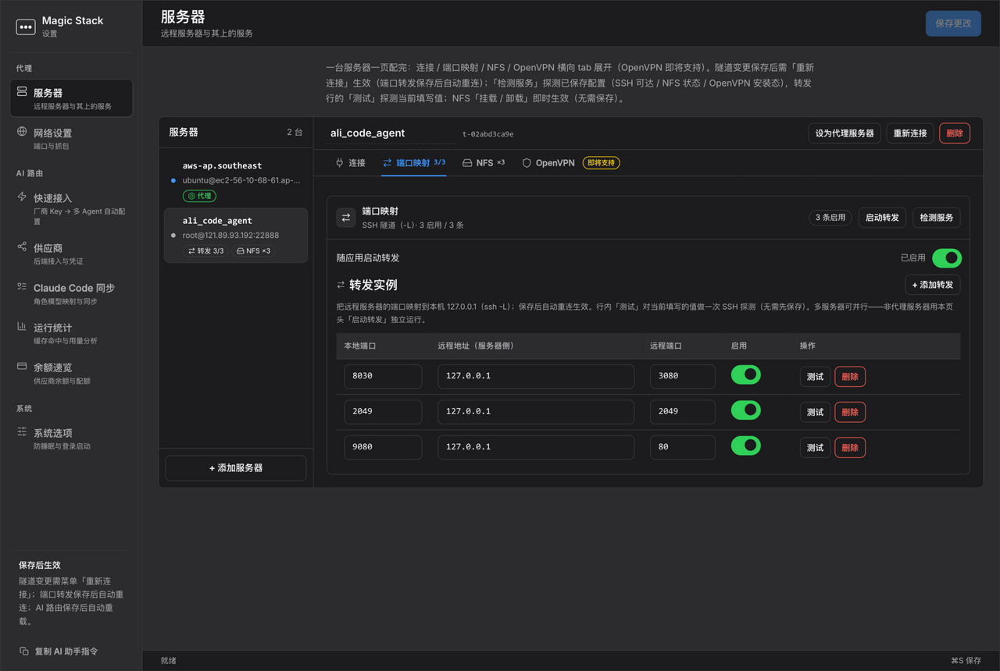
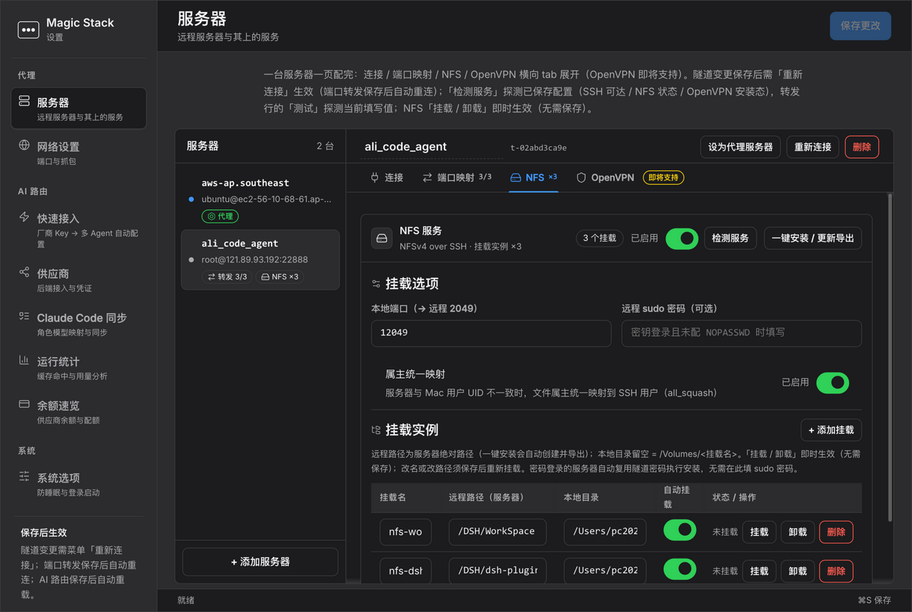

# Magic Stack — Route Claude Code to Any LLM from the macOS Menu Bar

**Local-first AI network stack: an LLM gateway that speaks Anthropic / OpenAI protocols, your own SSH tunnels, and TLS-level AI traffic capture — one native macOS app.**

[English](README.md) · [简体中文](README.zh-CN.md)

[](../../releases)
[](../../releases)
[](../../stargazers)


[](CONTEXT.md)


## The problems it solves

| Pain | With Magic Stack |
|---|---|
| **Claude Code is locked to one vendor and one bill** | Set `ANTHROPIC_BASE_URL` once, then route by model-prefix rules to **GLM / DeepSeek / Kimi / Qwen / OpenAI / Anthropic** — same workflow, cheaper or faster backend |
| **Every agent needs its own key and config** | **One key configures every agent**: the built-in engine sets up Claude Code, Codex, OpenCode and ZCode; they only ever hold a local gateway credential |
| **You can't see what agents send or spend** | TLS capture decrypts AI calls (OpenAI / Anthropic / DeepSeek / Doubao / Qwen / MiniMax) into readable JSONL, with per-provider usage, cache-hit-rate and balance in one panel |
| **Your traffic should ride your own server** | SSH SOCKS5 proxy + parallel `ssh -L` port forwarding + NFSv4 mounts, all toggled from the menu bar |

Keys never leave your machine. Zero telemetry. MIT.

## Route Claude Code to GLM in 60 seconds

```bash
# 1. App → Preferences → AI Routing → Providers
#    add GLM  https://open.bigmodel.cn/api/anthropic  + your API key
#    set router.default = GLM/glm-5.2
# 2. Point Claude Code at the gateway:
export ANTHROPIC_BASE_URL=http://127.0.0.1:9527
claude   # every request now routes per your rules
```

Mix models per tier — strong models for main threads, cheap ones for subagents:

```yaml
rules:
  - match_prefix: claude-opus     # heavy lifting
    route_to: GLM/glm-5.2
  - match_prefix: claude-sonnet   # daily work
    route_to: DeepSeek/deepseek-v4-pro
  - match_prefix: claude-haiku    # subagents → cheap
    route_to: KIMI/k3
```

## One app, three layers

| Layer | What you get |
|---|---|
| 🧮 **Route** — LLM gateway (`:9527`) | Three inbound protocols (Anthropic Messages / OpenAI Chat / Responses), prefix routing, same-protocol passthrough with auto-conversion on mismatch (SSE included), prompt-caching preserved, usage & balance stats |
| 🔗 **Access** — SSH tunnels (`:8888`) | SOCKS5 proxy through your own server, multi-tunnel `-L` forwards in parallel, key or Keychain-password auth, auto-retry and wake-triggered reconnect, one page per server (connection / forwards / NFS mounts / service detection) |
| 🔍 **Verify** — AI traffic capture | Bundled mitmdump cascades into the proxy; only known AI APIs are logged to JSONL — everything else passes untouched |

**Bonus — agent-operable:** “Copy AI assistant instructions” hands Claude Code a token-guarded local API, and it configures the app for you. The AI network tool your AI can run.





## Install

**macOS (recommended):** grab the signed + notarized `.dmg` from [Releases](../../releases), drag to `Applications`. ⚫ appears in the menu bar.

**From source:**

```bash
git clone https://github.com/benz-ai-x/magic-stack.git && cd magic-stack
pip3 install -r requirements-dev.txt && python3 app.py
```

**Linux / headless — Docker (gateway + web config):**

```bash
bash docker/suanpan.sh up    # gateway :9527 + web config :9528
bash docker/suanpan.sh sync  # writes ~/.claude/settings.json
```

## How it compares

| | **Magic Stack** | claude-code-router / LiteLLM | OpenRouter (SaaS) | manual ssh + configs |
|---|---|---|---|---|
| Runs | **Local-first** (menu bar / Docker) | Local or self-host | Their cloud | Your terminal |
| Keys & prompts | **Never leave your machine** | Yours | Sent to service | Yours |
| Sees actual AI traffic (TLS plaintext) | ✅ built in | ❌ | ❌ | needs mitmproxy setup |
| SSH access layer (SOCKS5 + `-L`, parallel) | ✅ built in | ❌ | ❌ | ✅ but manual |
| Cost / cache / usage closed-loop per rule | ✅ same app | partial | dashboard | ❌ |

## FAQ

**Does Claude Code really work with DeepSeek / GLM / Kimi?**
Yes — the gateway is fully Anthropic-Messages-compatible (SSE streaming, tool use, prompt-caching markers preserved). Only `ANTHROPIC_BASE_URL` changes. No patches, no hacks.

**How is this different from claude-code-router, LiteLLM or OpenRouter?**
A router forwards but can't see traffic; a SaaS sees your keys. Magic Stack is local-first **and** closes the loop: change a rule, watch real cost, latency and responses change in the same app.

**Where do my keys live? Is it free?**
MIT-licensed; it routes to *your* provider accounts. Keys sit in `~/.suanpan.yaml` (`0600`), masked in every UI. Zero telemetry, every endpoint binds to loopback.

**Does it work with Codex / OpenCode / ZCode?**
Yes — three inbound protocols; the quick-start wizard takes one key and configures every agent you tick.

**Linux / Windows?**
The Suanpan gateway ships as a Docker image; menu-bar shell, SSH tunnels and capture are macOS-only.

## Trust & engineering

- SSH passwords in the macOS **Keychain**, piped to `ssh` — never in `argv`/`ps`; `StrictHostKeyChecking=yes` with dedicated `known_hosts`
- Constant-time key comparison; credential-bearing outbound calls refuse cross-origin redirects and downgrades
- Config writes atomic (`0600`) with crash-recovery journal
- **2000+ tests**, 10 ADRs ([`docs/adr/`](docs/adr/)), drift-guarded domain glossary ([`CONTEXT.md`](CONTEXT.md))

## For curators (one-liner)

> **Magic Stack** — open-source macOS menu-bar app that routes Claude Code, Codex and other agents (Anthropic/OpenAI protocols) to GLM/DeepSeek/Kimi/Qwen/OpenAI through a local-first gateway, bundled with SSH tunnel/port-forwarding management and TLS-level AI traffic observability. MIT.

[`CHANGELOG.md`](CHANGELOG.md) · [`docs/docker-deploy.md`](docs/docker-deploy.md) · [`docs/adr/`](docs/adr/) · [`CONTEXT.md`](CONTEXT.md)

## License

[MIT](LICENSE) — Copyright (c) 2026 benz-ai-x

---

<div align="center">

**Route it. Tunnel it. See it.**

⭐ Star to follow releases · [Discussions](../../discussions) · [Issues](../../issues)

</div>
