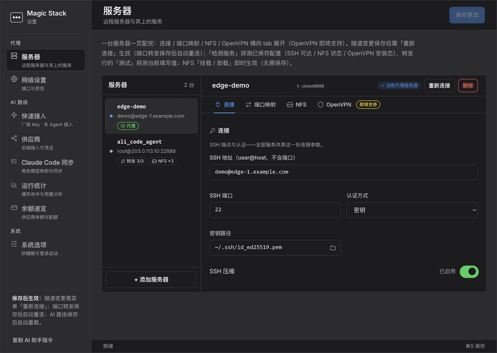
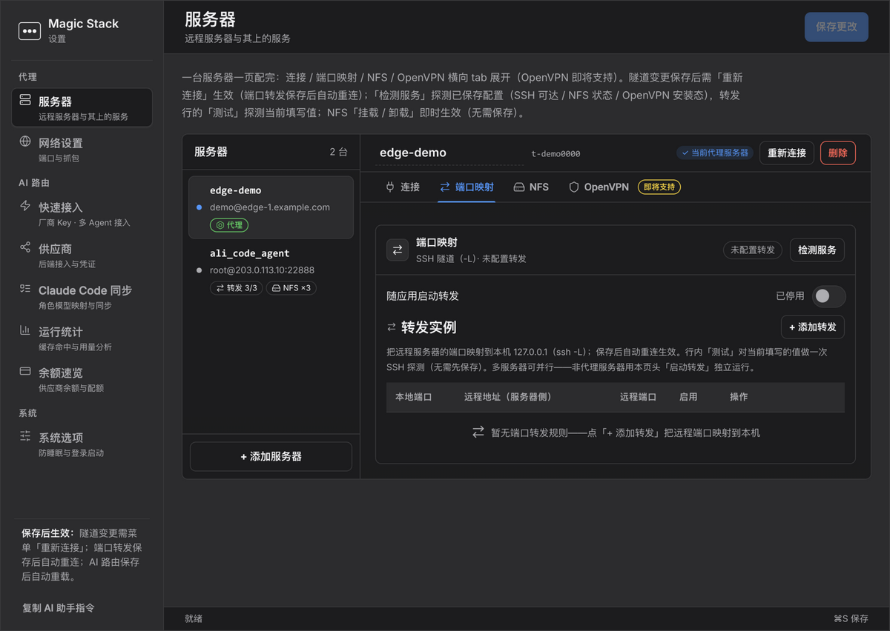
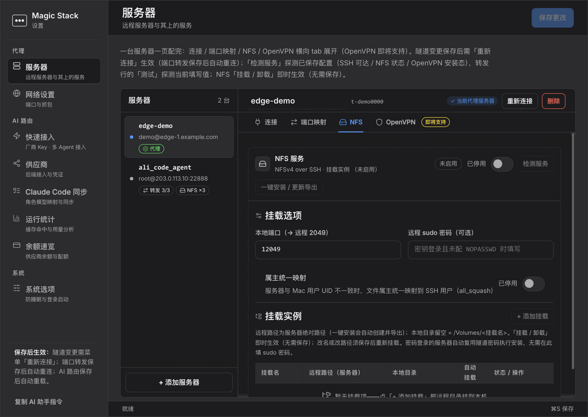

# Magic Stack — 菜单栏里的一站式 AI 工具栈：用 AI，总有几层用得上

**本地优先的 AI 万能栈：把 Claude Code / Codex / OpenCode / ZCode 路由到任意大模型（GLM / DeepSeek / Kimi / Qwen / OpenAI / Anthropic），经你自己的服务器打通 SSH 隧道、端口转发与 NFS 挂载，TLS 层抓包审计 AI 流量，按 Agent 统计成本、缓存与用量——不用记一堆工具，一个原生 macOS 应用全包。界面中英双语。**

[English](README.md) · [简体中文](README.zh-CN.md)

[](../../releases)
[](../../releases)
[](../../stargazers)


[](CONTEXT.md)



## 它解决什么痛点

| 痛点 | 用 Magic Stack |
|---|---|
| **Claude Code 被锁死在一家供应商、一张账单上** | 设一次 `ANTHROPIC_BASE_URL`，按模型前缀规则路由到 **GLM / DeepSeek / Kimi / Qwen / OpenAI / Anthropic**——工作流不变，后端更便宜或更快 |
| **每个 Agent 各配各的 Key，散落各处** | **一个 Key 配好全部 Agent**：内置引擎自动配置 Claude Code、Codex、OpenCode、ZCode，它们只持有本地网关凭证 |
| **看不见 Agent 发了什么、花了多少** | TLS 抓包解密 AI 调用（OpenAI / Anthropic / DeepSeek / 豆包 / Qwen / MiniMax）落可读 JSONL，分供应商用量、缓存命中率与余额一屏看清 |
| **流量要走自己的服务器** | SSH SOCKS5 代理 + 多隧道并行 `ssh -L` 端口转发 + NFSv4 挂载，全部菜单栏一键启停 |
| **界面被绑死在一种语言** | **中英双语全覆盖**——菜单栏与设置窗即时切换，可自动跟随系统语言 |

密钥永不出你的机器。零遥测。MIT。

## 60 秒把 Claude Code 接到 GLM

```bash
# 1. 应用 → 偏好设置 → AI 路由 → 供应商
#    添加 GLM  https://open.bigmodel.cn/api/anthropic  + 你的 API Key
#    设置 router.default = GLM/glm-5.2
# 2. 把 Claude Code 指到网关：
export ANTHROPIC_BASE_URL=http://127.0.0.1:9527
claude   # 此后每个请求按你的规则路由
```

按档位混搭模型——主线程用强模型，子代理用便宜模型：

```yaml
rules:
  - match_prefix: claude-opus     # 重活
    route_to: GLM/glm-5.2
  - match_prefix: claude-sonnet   # 日常
    route_to: DeepSeek/deepseek-v4-pro
  - match_prefix: claude-haiku    # 子代理 → 便宜
    route_to: KIMI/k3
```

## 一个应用，三层闭环

| 层 | 你得到什么 |
|---|---|
| 🧮 **路由** — 大模型网关（`:9527`） | 三种入站协议（Anthropic Messages / OpenAI Chat / Responses）、前缀路由、同协议直通失配自动转换（含 SSE 流式）、prompt caching 保留、用量与余额统计 |
| 🔗 **接入** — SSH 隧道（`:8888`） | 经你自己服务器的 SOCKS5 代理、多隧道并行 `-L` 转发、密钥或 Keychain 密码认证、自动重试与唤醒重连、一台服务器一页配完（连接/转发/NFS 挂载/服务检测） |
| 🔍 **验证** — AI 流量抓包 | 内置 mitmdump 级联进代理；只把已知 AI API 的调用落 JSONL，其余流量原样放行 |





**彩蛋——Agent 可自助操作：**「复制 AI 助手指令」给 Claude Code 一个 token 保护的本地 API，它替你把应用配好。你的 AI 能自己开的 AI 网络工具。

## 速览

| | |
|---|---|
| 当前版本 | **v0.14.0** — 中英双语界面、NFS 挂载修复（[发布说明](../../releases)，附签名公证 DMG） |
| 平台 | macOS（Apple Silicon，签名 + 公证）· Linux/无头经 Docker |
| 界面语言 | English、简体中文（自动跟随 / 手动切换） |
| 入站协议 | Anthropic Messages · OpenAI Chat · OpenAI Responses |
| 自动配置的 Agent | Claude Code · Codex · OpenCode · ZCode |
| 可路由供应商 | GLM · DeepSeek · Kimi · Qwen · OpenAI · Anthropic（+ 任意 OpenAI 兼容端点） |
| 本地端口 | `9527` 网关 · `8888` SOCKS5 · `9528` 网页配置 |
| 凭证存放 | Key 存 `~/.suanpan.yaml`（`0600`），SSH 密码存 macOS 钥匙串 |
| 质量 | 2177 pytest + 147 node 测试、12 篇 ADR、文档防漂移守卫 |

## 安装

**macOS（推荐）：** 从 [Releases](../../releases) 下载签名公证的 `.dmg`，拖进「应用程序」。菜单栏出现 ⚫。

**源码运行：**

```bash
git clone https://github.com/benz-ai-x/magic-stack.git && cd magic-stack
pip3 install -r requirements-dev.txt && python3 app.py
```

**Linux / 无头 — Docker（网关 + 网页配置）：**

```bash
bash docker/suanpan.sh up    # 网关 :9527 + 网页配置 :9528
bash docker/suanpan.sh sync  # 写入 ~/.claude/settings.json
```

## 横向对比

| | **Magic Stack** | claude-code-router / LiteLLM | OpenRouter（SaaS） | 手工 ssh + 配置 |
|---|---|---|---|---|
| 运行位置 | **本地优先**（菜单栏 / Docker） | 本地或自托管 | 别人的云 | 你的终端 |
| 密钥与提示词 | **永不出你的机器** | 自己的 | 发给服务方 | 自己的 |
| 看得见真实 AI 流量（TLS 明文） | ✅ 内置 | ❌ | ❌ | 要自己搭 mitmproxy |
| SSH 接入层（SOCKS5 + `-L` 并行） | ✅ 内置 | ❌ | ❌ | ✅ 但全手工 |
| 成本/缓存/用量按规则闭环 | ✅ 同一应用 | 部分 | 仪表盘 | ❌ |
| 中英双语界面一键切换 | ✅ | 部分 | ✅ | 无此概念 |

## 常见问题

**Claude Code 真的能用 DeepSeek / GLM / Kimi 吗？**
能——网关完全兼容 Anthropic Messages 协议（SSE 流式、工具调用、prompt caching 标记保留），只改 `ANTHROPIC_BASE_URL`，不打补丁不动手脚。

**有英文（或中文）界面吗？**
两者都有，且全覆盖：菜单栏、设置窗、登录页、校验提示。菜单栏或「设置 → 系统选项」一键切换，也可自动跟随系统语言。

**与 claude-code-router、LiteLLM、OpenRouter 有什么不同？**
路由器只转发看不见流量；SaaS 看得见你的密钥。Magic Stack 本地优先**且闭环**：改一条规则，同一个应用里立刻看到真实成本、延迟与响应的变化。

**密钥放在哪？免费吗？**
MIT 协议；路由到*你自己的*供应商账户。Key 存 `~/.suanpan.yaml`（`0600`），所有界面掩码显示。零遥测，全部端点只绑回环地址。

**支持 Codex / OpenCode / ZCode 吗？**
支持——三种入站协议；快速接入向导填一个 Key，勾选即配好全部 Agent。

**Linux / Windows 呢？**
Suanpan 网关提供 Docker 镜像；菜单栏外壳、SSH 隧道与抓包为 macOS 专属。

## 信任与工程

- SSH 密码存 macOS **钥匙串**，经管道喂给 `ssh`——绝不进 `argv`/`ps`；`StrictHostKeyChecking=yes` 配独立 `known_hosts`
- 常量时间密钥比较；携带凭证的出站调用拒绝跨 origin 重定向与降级
- 配置写入原子化（`0600`）+ 崩溃恢复日志
- **2177 项测试**、12 篇 ADR（[`docs/adr/`](docs/adr/)）、防漂移领域词汇表（[`CONTEXT.md`](CONTEXT.md)）

## 给收录方的一句话

> **Magic Stack** — 开源 macOS 菜单栏应用，给每个用 AI 的人的一站式工具栈：本地大模型网关（Claude Code / Codex / OpenCode / ZCode → GLM / DeepSeek / Kimi / Qwen / OpenAI / Anthropic）、SSH 隧道与端口转发管理、NFS 挂载、TLS 层 AI 流量抓包、按 Agent 的成本与用量统计。中英双语。MIT。

[`CHANGELOG.md`](CHANGELOG.md) · [`docs/docker-deploy.md`](docs/docker-deploy.md) · [`docs/adr/`](docs/adr/) · [`CONTEXT.md`](CONTEXT.md)

## 许可

[MIT](LICENSE) — Copyright (c) 2026 benz-ai-x

---

<div align="center">

**路由它。隧道它。看清它。**

⭐ Star 跟随版本 · [讨论区](../../discussions) · [问题反馈](../../issues)

</div>
