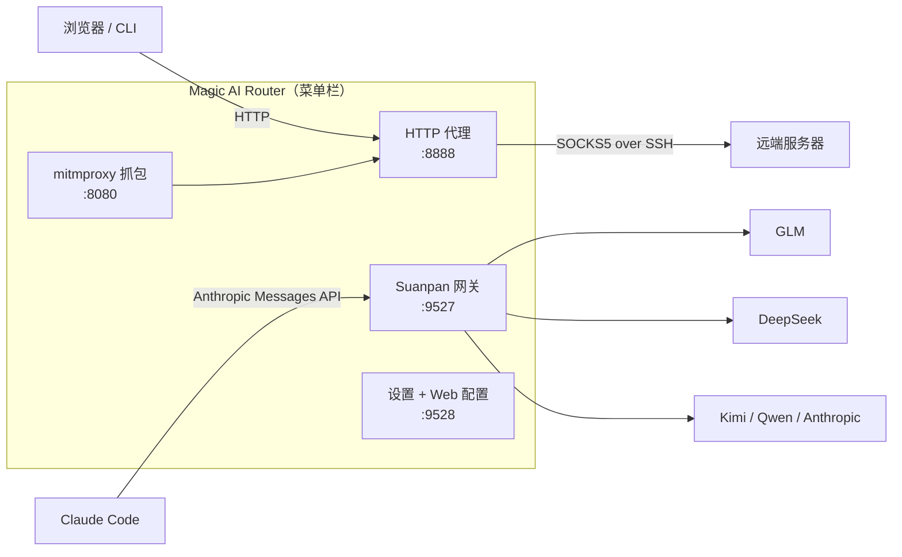

# Magic AI Router

**住在你 macOS 菜单栏里的网络指挥官：SSH 隧道代理 + TLS 抓包 + AI 请求路由网关（LLM Router），收进一枚状态图标。**

[English](README.md) · [简体中文](README.zh-CN.md)


Magic AI Router 把三件工具装进一个原生 `.app`：

1. **Magic Proxy** — SSH 隧道代理。本地起 HTTP 代理（`:8888`），流量经 SSH 动态转发（`ssh -D` SOCKS5）抵达远端服务器。支持多隧道、密钥/密码认证、系统代理管理、唤醒/网络切换自动重连。
2. **AI 抓包** — 基于 mitmproxy 的 TLS 抓包模式。实时解密 HTTPS，把 AI API 的请求/响应（OpenAI、Anthropic、DeepSeek、豆包、Qwen、MiniMax）落成 JSONL——你的 AI 应用发了什么、花了多少 token，白纸黑字。
3. **Suanpan（算盘）AI 路由网关** — 本地 LLM 路由器，对外讲 Anthropic Messages 协议（`:9527`）。Claude Code（或任意 Anthropic 兼容客户端）指过来，请求按规则分发到 GLM / DeepSeek / Kimi / Qwen / Anthropic——换模型改的是规则，不是你的工作流。也可用 Docker 部署在 Linux 上。

不占 Dock、不开终端、不啃配置文件——常驻菜单栏，不吵不闹。

---

## 为什么是 Magic AI Router

- **一条隧道，全局畅通。** 浏览器和 CLI 工具只管对 `127.0.0.1:8888` 说 HTTP，应用透明地经 SSH SOCKS5 隧道转发到远端——你的流量从此有了自己的专用车道。
- **看见 AI 在说什么。** TLS 抓包把 AI API 调用解成可读的 JSONL：每一段 prompt、每一次响应、每一个 token，不再是黑盒。
- **一个入口，多家大模型。** Suanpan 按模型名前缀把 `claude-*` 请求分发到你选的后端：`claude-sonnet → deepseek/v4-pro`、`claude-haiku → glm-5.2`……改规则，不改代码。
- **放着不管也稳。** 菜单栏常驻（`LSUIElement`，无 Dock 图标）、登录自启、防睡眠、唤醒即重连、无限退避重试（封顶 60 秒，永不放弃）。

## 它怎么工作

```
浏览器 / CLI ──HTTP :8888──▶ SOCKS5 :1080 ──SSH 隧道──▶ 远端服务器

Claude Code ──POST :9527/v1/messages──▶ Suanpan 路由 ──▶ GLM / DeepSeek / Kimi / Anthropic …
```



## 功能全貌

### 🔗 Magic Proxy — SSH 隧道 HTTP→SOCKS5 代理

- 纯 Python asyncio HTTP 代理，逐请求归属定界（keep-alive 安全、CONNECT 隧道、chunked body）
- 多条命名隧道，菜单一键切换
- 密钥认证（`ssh -i`）或密码认证（经 `sshpass`；密码只存 macOS 钥匙串，经管道注入——绝不出现在 `argv`/`ps`）
- 严格主机密钥策略 + 应用专用 `known_hosts`——新服务器指纹必须你亲眼确认（TOFU + 固定）
- 自动重连：退避封顶 60 秒且永不放弃；系统唤醒事件跳过退避立即重连（分钟级恢复 → 约 5 秒）
- 可选的事务式系统代理管理（`networksetup`）——断开或崩溃时自动恢复你的原有设置
- 单应用代理：经 `--proxy-server` 启动 Chromium 应用（ChatGPT/Claude/Discord 网页版），不动系统设置

### 🔍 AI 抓包 — TLS 流量记录器

- 菜单一点，内置的 mitmdump（`:8080`）拉起并级联进代理
- 所有 HTTPS 都经过解密转发，但只有已知 AI API 的请求/响应落盘到 `~/.magic-proxy-captures/<日期>.jsonl`，其余流量静默放行
- 开箱识别 6 家：OpenAI、Anthropic、DeepSeek、豆包、Qwen、MiniMax
- 首次使用有引导式根 CA 信任流程；抓包保留天数可配

### 🧮 Suanpan — AI 路由网关（LLM Router）

FastAPI 网关，在 `:9527` 对外提供 **Anthropic Messages API**，把请求分发到多家 LLM 后端：

```bash
export ANTHROPIC_BASE_URL=http://127.0.0.1:9527
# Claude Code 从此走你的路由规则
```

- **供应商** — 任何兼容 Anthropic Messages 协议的端点；API Key 内联、环境变量或自定义认证头皆可
- **模型规则** — 前缀匹配：`claude-opus → GLM/glm-5.2`、`claude-sonnet → DeepSeek/deepseek-v4-pro`
- **内联覆盖** — model 字段写 `供应商/模型`（如 `KIMI/k3`）直接绕过规则；system prompt 里的 `<SUBAGENT-MODEL>` 标签对子代理做同样的事——子代理用便宜模型，主线程用强模型
- **缓存感知** — `anthropic_native` 供应商完整保留 `cache_control` 标记，上游 prompt cache 不失效；统计面板实时看缓存命中率
- **流式** — SSE 全程透传 + 用量提取；只做安全重试（非幂等请求绝不重放）
- **用量与余额** — 本地 JSONL 用量日志，今日/近 7 天/自然月/全部多档聚合，按供应商与路由来源分组；供应商余额与套餐配额集中速览
- **Claude Code 同步** — 设置页把 Claude Code 各角色（主任务/子代理/规划……）映射到模型，一键写入 `~/.claude/settings.json`

路由优先级（命中即停）：

| 优先级 | 机制 | 示例 |
|---|---|---|
| 1 | 内联覆盖（model 字段含 `供应商/模型`） | `deepseek/deepseek-chat` |
| 2 | system prompt 中 `<SUBAGENT-MODEL>` 标签 | `<SUBAGENT-MODEL>KIMI/k3</SUBAGENT-MODEL>` |
| 3 | 前缀规则 | `claude-sonnet* → DeepSeek/deepseek-v4-pro` |
| 4 | 默认路由 | `router.default` |

显式覆盖指向未知/停用供应商时，请求回落到规则/默认路由——但会带着 `x-suanpan-fallback` 响应头大声宣告，绝不静默误投。

### 🛡️ 安全设计

- SSH 密码只存 macOS 钥匙串，经管道注入 `ssh`（绝不进 `argv`、`ps`、配置文件）
- `StrictHostKeyChecking=yes` + 应用专用 `known_hosts`——中间人攻击直接失败关闭
- 网关 API Key 校验用常量时间比较；配置服务默认只绑回环 + bearer token 认证（设置窗走 HttpOnly 会话 cookie）
- 带凭证的出站请求拒绝跨 origin 重定向与 HTTPS→HTTP 降级；响应体上限 1 MB
- 配置原子写入（`0600` 权限）+ journal 崩溃恢复；掩码密钥明文绝不出 UI

## 快速开始

### macOS — 下载安装（推荐）

1. 从 [Releases](../../releases) 下载最新 **`.dmg`**（已公证，Gatekeeper 不拦）
2. 拖进 `Applications`
3. 启动——菜单栏出现 ⚫

### macOS — 源码运行

```bash
git clone https://github.com/benz-ai-x/Magic-AI-Router.git
cd Magic-AI-Router
pip3 install -r requirements-dev.txt
python3 app.py
```

### macOS — 自己打包 `.app`

构建机需 Python 3.12（mitmproxy ≥12 要求；应用本身支持下限 3.9）：

```bash
git clone https://github.com/benz-ai-x/Magic-AI-Router.git
cd Magic-AI-Router
bash build.sh
cp -R "dist/Magic AI Router.app" /Applications/
```

### Linux / 无 GUI — Docker（仅 Suanpan 网关）

不带隧道、抓包或 GUI——只有 AI 路由网关 + Web 配置页：

```bash
git clone https://github.com/benz-ai-x/Magic-AI-Router.git
cd Magic-AI-Router
bash docker/suanpan.sh up
```

- **网关** `http://127.0.0.1:9527`（Claude Code 指向这里）
- **配置页** `http://127.0.0.1:9528`——token 取自 `bash docker/suanpan.sh config-ui`
- **一键对接 Claude Code**：`bash docker/suanpan.sh sync`（写入 `~/.claude/settings.json`）
- 配置页保存即热重载运行中的网关；配置与用量日志落在 `docker/data/`（容器重建不丢）

完整部署文档：[`docs/docker-deploy.md`](docs/docker-deploy.md)。

### macOS 首次上手

1. 启动应用——菜单栏出现 ⚫ 图标
2. 点菜单「**偏好设置…**」
3. 「代理 → 隧道」填入 SSH 信息（密钥 / 密码都行）
4. 点菜单「**重新连接**」
5. 浏览器 HTTP 代理指向 `127.0.0.1:8888`——**通了**

密码认证需先装 `sshpass`：

```bash
brew install hudochenkov/sshpass/sshpass
```

## 配置

| 文件 | 管什么 |
|---|---|
| `~/.magic-proxy.json` | 隧道、代理端口、抓包设置、系统选项 |
| `~/.suanpan.yaml` | 网关：供应商、路由规则、用量日志（见 [`docs/examples/suanpan.example.yaml`](docs/examples/suanpan.example.yaml)） |

一切也可在设置窗（⌘,）里完成——无需手改文件：

| 分组 | 页面 | 你能做什么 |
|---|---|---|
| 代理 | 隧道 | SSH 连接 master-detail，增删改一气呵成 |
| 代理 | 网络设置 | SOCKS5/HTTP 端口、抓包目录、保留天数 |
| 系统 | 系统选项 | 防睡眠、登录启动、设为系统代理 |
| AI 路由 | 供应商 | 后端接入与凭证（API Key / 环境变量 / 认证头） |
| AI 路由 | Claude Code 同步 | 角色模型映射与默认兜底，同步写入 Claude Code |
| AI 路由 | 运行统计 | 今日 / 近 7 天 / 全部用量、缓存命中率与路由来源 |
| AI 路由 | 余额速览 | 供应商余额与套餐配额，独立刷新 |

⌘S 保存。隧道变更点菜单「重新连接」生效。

菜单栏状态图标：🟢 已连接 · 🟡 连接中 · ⚫ 未连接。

## 🤖 让 AI Agent 帮你配置

Magic AI Router 内置 AI Agent 可读的产品上下文。应用运行时打开偏好设置，点侧边栏底部 **「📋 复制 AI 助手指令」**，粘贴给 Claude Code 或任意 AI 助手——它会自动了解产品、读取你的当前配置、帮你完成设置。

Agent 也可以直接访问：

```
http://127.0.0.1:9528/agent.md      # 产品文档 + API 说明（无需 token）
http://127.0.0.1:9528/api/state     # 当前配置（需 bearer token）
```

## 架构

纯 Python（≥3.9；打包工具链因 mitmproxy 用 3.12），无 Node、无 Electron——rumps 菜单栏壳承载：

- `tunnel/` — asyncio HTTP→SOCKS5 代理、SSH 子进程生命周期、重试/重连调度
- `capture/` — mitmdump 子进程、CA 信任流程、AI 请求抽取 addon
- `suanpan/` — FastAPI 网关：路由决策、流式转发、用量日志、预热
- `services/` — 配置服务（:9528）、网关运行时、Claude Code 设置、生命周期编排
- `mpconf/` / `sysctl/` / `shellui/` — 配置事务、系统集成、界面

线程模型：主线程跑菜单栏 run loop + daemon 线程跑 asyncio 代理、uvicorn 网关、配置服务。深读文档：[`CONTEXT.md`](CONTEXT.md)（领域术语表）与 [`docs/adr/`](docs/adr/)（架构决策记录）。

## 文档

- [`CHANGELOG.md`](CHANGELOG.md) — 版本历史
- [`docs/docker-deploy.md`](docs/docker-deploy.md) — Linux/Docker 网关部署
- [`docs/adr/`](docs/adr/) — ADR：系统架构、TLS 抓包、配置掩码、Claude Code 环境契约、prompt caching
- [`CONTEXT.md`](CONTEXT.md) — 领域术语表

## 许可证

[MIT](LICENSE) ——  Copyright (c) 2026 benz-ai-x

---

<div align="center">

**Magic AI Router** · 让网络听你的

[下载最新版](../../releases) · [提 Issue](../../issues)

</div>
