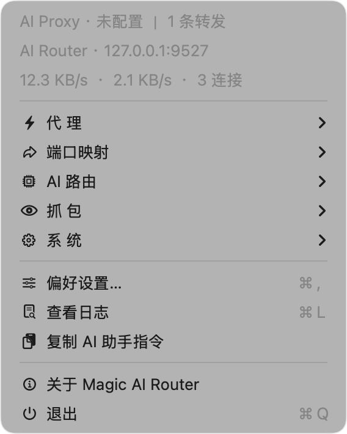
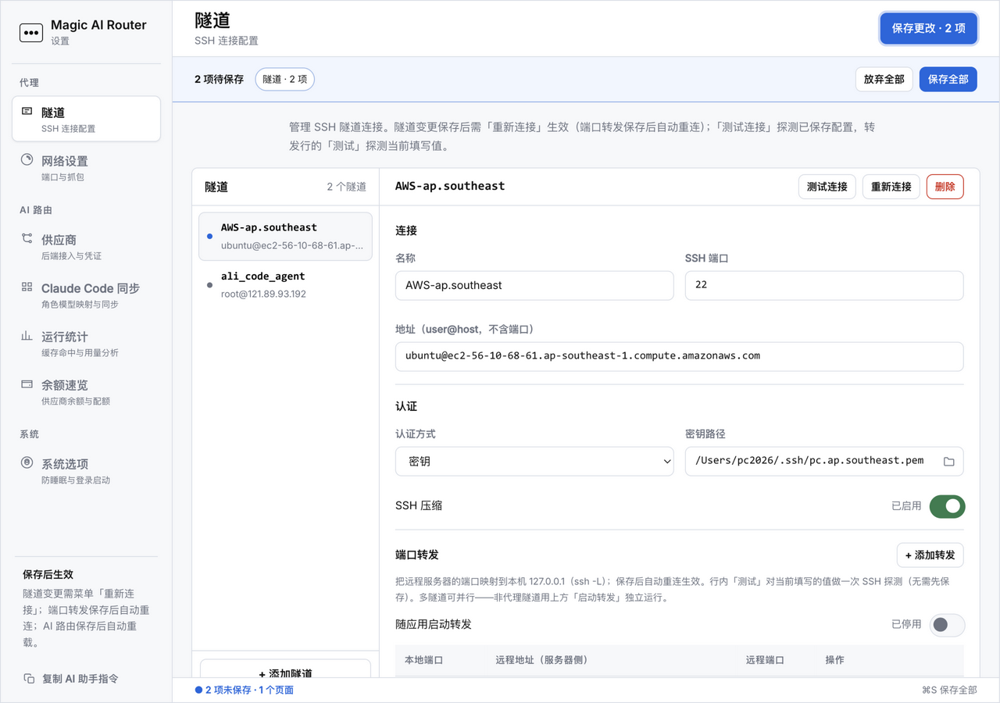

# Magic Stack

**住进菜单栏的本地 AI 网络栈：路由 Claude Code 到任意模型、走自己的隧道、亲眼看见 AI 应用到底发了什么。**

[English](README.md) · [简体中文](README.zh-CN.md)

[](../../releases)
[](../../releases)
[](../../stargazers)


[](CONTEXT.md)



路由器只管转发，代理只搬字节——**Magic Stack 把闭环装进一个原生 macOS 应用**：接入层（你自己的 SSH 隧道）、路由层（讲你 Agent 协议的本地网关——Anthropic / OpenAI Chat / Responses）、观测层（AI 流量 TLS 解密）三层齐备。改一条路由规则，**同一应用里**就能看到真实的成本、延迟与返回变化。密钥永不出你的机器。

| 层 | 你得到什么 |
|---|---|
| 🧮 **路由** | 本地网关（`:9527`）三协议入站——**Anthropic Messages / OpenAI Chat / Responses**：Claude Code、Codex、OpenCode、ZCode 指过来，**一个 Key 配好全部 Agent**，按模型前缀路由到 **GLM / DeepSeek / Kimi / Qwen / OpenAI / Anthropic** 等 |
| 🔗 **接入** | 经你自己服务器的 SSH SOCKS5 代理（`:8888`）+ **多隧道并行 `ssh -L` 端口转发**，全部菜单栏启停 |
| 🔍 **验证** | TLS 抓包解密 AI 调用（OpenAI、Anthropic、DeepSeek、豆包、Qwen、MiniMax）落可读 JSONL + 分供应商用量、缓存命中率与余额统计 |

## 60 秒上手

装它的第一大理由：**保留 Claude Code 的工作流，换掉后端（和账单）**。

```bash
# 1. 启动应用 → 偏好设置 → AI 路由 → 供应商
#    添加 GLM  https://open.bigmodel.cn/api/anthropic  + 你的 API Key
#    设 router.default = GLM/glm-5.2
# 2. 把 Claude Code 指向网关：
export ANTHROPIC_BASE_URL=http://127.0.0.1:9527
claude   # 此后每个请求都按你的规则路由
```

按档位混搭模型——主线程用强模型，子代理用便宜模型：

```yaml
rules:
  - match_prefix: claude-opus     # 重活
    route_to: GLM/glm-5.2
  - match_prefix: claude-sonnet   # 日常
    route_to: DeepSeek/deepseek-v4-pro
  - match_prefix: claude-haiku    # 子代理 → 便宜
    route_to: KIMI/k3
```

任何地方把模型写成 `供应商/模型`（如 `DeepSeek/deepseek-chat`）即绕过全部规则。

## 为什么不直接用 …？

给比较型用户和清单维护者：

| | **Magic Stack** | claude-code-router / LiteLLM | OpenRouter（SaaS） | 手动 ssh + 配置 |
|---|---|---|---|---|
| 运行位置 | **本地优先**（菜单栏 / Docker） | 本地或自建服务 | 别人的云 | 你的终端 |
| 密钥与提示词 | **绝不出本机** | 自建则你的 | 发给服务方 | 你的 |
| 看得见 AI 明文流量（TLS 解密） | ✅ 内置 | ❌ | ❌ | 要自己搭 mitmproxy |
| SSH 接入层（SOCKS5 + `-L` 并行转发） | ✅ 内置 | ❌ | ❌ | ✅ 但纯手动 |
| 逐规则成本/缓存/用量闭环 | ✅ 同一应用 | 部分 | 仪表盘 | ❌ |
| macOS 原生体验（菜单栏 + 设置窗） | ✅ | CLI/配置 | 网页 | ❌ |
| AI 代理可自主配置 | ✅ `agent.md` + token API | ❌ | ❌ | ❌ |

**差异在闭环，不在单层**——看不见流量的路由器是盲飞，看得见流量的代理不会路由。



## 安装

**macOS（推荐）**：从 [Releases](../../releases) 下载签名 + 公证的 `.dmg`，拖进 `Applications`——菜单栏出现 ⚫。

**源码运行 / 自行打包：**

```bash
git clone https://github.com/benz-ai-x/Magic-AI-Router.git
cd Magic-AI-Router
pip3 install -r requirements-dev.txt && python3 app.py     # 运行
# bash build.sh                                            # 或打包
```

**Linux / 无头 — Docker（网关 + Web 配置）：**

```bash
bash docker/suanpan.sh up      # 网关 :9527 + Web 配置 :9528
bash docker/suanpan.sh sync    # 写入 ~/.claude/settings.json 接好 Claude Code
```

macOS 首次运行：偏好设置 → **代理 → 隧道** 填 SSH 信息 → 菜单 **代 理 ▸ 连接代理** → 浏览器代理指 `127.0.0.1:8888`；在 **端口映射 ▸** 把远程端口逐条映射到本机（行内点击即启停）。密码认证需先装一次 `sshpass`（`brew install hudochenkov/sshpass/sshpass`）。

## 里面有什么

### 🧮 算盘 — AI 路由网关

- **供应商**——GLM/DeepSeek/Kimi/Qwen/OpenAI/Anthropic/OpenRouter/硅基流动/火山方舟内置端点卡（每厂商 anthropic/openai/responses 三协议矩阵 + 认证头 + 余额语法），自定义端点随意加；API Key 内联 / 环境变量 / 自定义认证头
- **路由**——前缀规则 → 默认路由；`供应商/模型` 内联覆盖；`<SUBAGENT-MODEL>` 子代理标签；显式误投大声回落（`x-suanpan-fallback` 头），绝不静默
- **感知 Prompt 缓存**——`anthropic_native` 供应商保留 `cache_control`，上游缓存继续生效；统计页跟踪命中率
- **协议与流式**——同协议直通优先、失配自动转换（Anthropic⇄OpenAI Chat 全量翻译含 SSE 流式）；用量提取四车道一致；只做安全重试（非幂等请求绝不重放）
- **用量与余额**——JSONL 用量日志，今日/7天/月/全量按供应商与路由来源聚合；余额/配额面板
- **Agent 配置引擎**——**一个 Key 配好全部 Agent**：Claude Code（角色映射到模型，写 `~/.claude/settings.json`）/ Codex（增量编辑 `config.toml`）/ OpenCode / ZCode；各 Agent 里只写本地网关凭证，厂商 Key 永不落 Agent 配置；「保存并同步」同时把角色表 upsert 成网关 tier 路由规则（规则=持久真相、env 是投影）

### 🔗 Magic Proxy — SSH 隧道 + 端口转发

- **v0.13 服务器中心配置**——一台远程服务器一页配完（Server → Service → Instance，ADR-011）：连接 + SSH 隧道服务（转发实例）+ NFS 服务（挂载实例）+ OpenVPN（占位）同视图，每张服务卡可一键检测这台机器上实际可用什么（SSH 可达 / NFS 2049+导出 / OpenVPN 装没装）；旧 `tunnels[]` 配置自动迁移，服务器名/密钥/挂载/Keychain 密码原样保留
- asyncio HTTP→SOCKS5 代理，逐请求归属绑定（keep-alive 安全、CONNECT、chunked）
- **v0.9 多活**：一条代理隧道（`-D`）+ 任意多条纯转发隧道（`-L`）并行——服务器 A 当代理、服务器 B 映射端口到 `127.0.0.1`；独立重试、独立 host-key 处理、`forward_autostart` 随启动恢复；**转发行逐条点击启停**（停用不占端口，未运行的会话绝不拉起）
- 每条规则一键 SSH 可达性测试（未保存的值也能测）
- 密钥或密码认证（`sshpass`；密码只存 macOS 钥匙串，管道注入——绝不出现在 `argv`/`ps`）
- TOFU 主机密钥 pinning；退避封顶 60s 永不放弃；唤醒即重连（约 5 秒）；事务式系统代理管理；Chromium 应用 `--proxy-server` 单独走代理

### 🔍 AI 抓包 — AI API 的 TLS 记录器

- 一键启动内置 mitmdump 级联进代理；只记录已知 AI API 到 `~/.magic-proxy-captures/<日期>.jsonl`，其余原样放行
- 根 CA 信任引导；保留天数可配

## 信任与工程

安全敏感的工具，信任要在明处：

- **零遥测**——不回传任何数据；全部端点绑回环
- SSH 密码住 macOS **钥匙串**、管道交给 `ssh`（绝不进 `argv`/`ps`/文件）；`StrictHostKeyChecking=yes` + 专用 `known_hosts`
- 常量时间密钥比较；带凭证出站拒绝跨 origin 重定向与 HTTPS→HTTP 降级；响应上限 1MB
- 配置原子写入（`0600`）+ 崩溃恢复日志；掩码 Key 明文绝不出 UI
- **2000+ 测试**、架构决策记录（[`docs/adr/`](docs/adr/)）、防漂移领域词汇表（[`CONTEXT.md`](CONTEXT.md)）——纪律在仓库里，不在嘴上

## 🤖 Agent 可自主操作

偏好设置 → **「复制 AI 助手指令」**，粘给 Claude Code：代理读 `http://127.0.0.1:9528/agent.md`（免 token），再经 token 守卫的本地 API 帮你配置好一切。**能被 AI 自己操作的 AI 网络工具。**（同一复制动作也在设置窗侧栏——浏览器直开面板同样可用，经 token 守卫的 `/api/agent-instructions` 端点回退。）

## 常见问题

**Claude Code 真的能用 DeepSeek / GLM / Kimi 吗？**
能——网关完整兼容 Anthropic Messages API（SSE 流式、工具调用、提示词缓存标记保留）。Claude Code 只改 `ANTHROPIC_BASE_URL`，不打补丁。

**免费吗？密钥放哪？**
MIT 开源，路由到**你自己的**供应商账号。密钥存 `~/.suanpan.yaml`（`0600`），UI 全程掩码，明文绝不出进程。零遥测。

**和普通代理/普通路由器有什么区别？**
代理搬字节但不会路由；路由器转发但看不见流量。本应用两者兼备并闭环：同一界面里看每条规则的成本、缓存与返回。

**Codex / OpenCode / ZCode 也能接吗？**
能——网关三协议入站，快速接入向导选厂商填一个 Key 即配好勾选的全部 Agent；各 Agent 持有的是本地网关凭证。

**能把远程端口转发到本机且不暴露吗？**
逐隧道 `ssh -L` 只绑 `127.0.0.1`，与 SOCKS5 隧道并行，重连互不影响。

**支持 Linux / Windows 吗？**
Linux：算盘网关有 Docker 镜像。菜单栏壳、SSH 隧道与抓包为 macOS 专属。

## 给清单维护者的一句话

> **Magic Stack** — 开源 macOS 菜单栏应用：把 Claude Code / Codex 等 Agent（Anthropic / OpenAI 协议）经本地优先的网关路由到 GLM/DeepSeek/Kimi/Qwen/OpenAI 等，内置 SSH 隧道/端口转发管理与 TLS 层 AI 流量观测。MIT。

## 文档

[`CHANGELOG.md`](CHANGELOG.md) · [`docs/docker-deploy.md`](docs/docker-deploy.md) · [`docs/adr/`](docs/adr/)（10 篇 ADR）· [`CONTEXT.md`](CONTEXT.md)（领域词汇表）

## 许可

[MIT](LICENSE) — Copyright (c) 2026 benz-ai-x

---

<div align="center">

**路由它。隧道它。看见它。**

⭐ Star 跟进版本 · [讨论区](../../discussions) · [反馈问题](../../issues)

</div>
