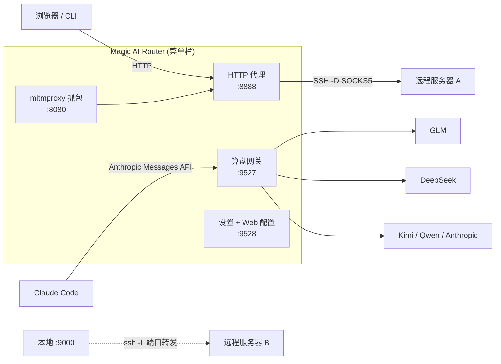

# Magic AI Router

**让 Claude Code 直连 GLM / DeepSeek / Kimi，不改一行工作流——外加 SSH 隧道代理（含端口转发）与 AI 流量 TLS 抓包，全部收进一个开源 macOS 菜单栏应用。**

[English](README.md) · [简体中文](README.zh-CN.md)

[](../../releases)
[](../../releases)
[](../../stargazers)


一个原生 `.app`、一个状态图标，装着**三件工具**：

1. **🧮 算盘（Suanpan）— AI 路由网关。** 本地网关，对外说 **Anthropic Messages API**（`:9527`）。Claude Code 或任何 Anthropic 兼容客户端指向它，按规则把请求路由到 GLM（智谱）、DeepSeek、Kimi（月之暗面）、Qwen 或真正的 Anthropic——换模型改配置，不改代码。也可用 Docker 部署在 Linux。
2. **🔗 Magic Proxy — SSH 隧道代理 + 端口转发。** 本地 HTTP 代理（`:8888`）经你自己的服务器转发（`ssh -D` SOCKS5），并有 `ssh -L` 本地端口转发——**多条隧道并行运行**：服务器 A 当代理、服务器 B 把远程端口映射到 `127.0.0.1`，全部从菜单栏启停。
3. **🔍 AI 抓包 — TLS 流量记录器。** 基于 mitmproxy：实时解密 HTTPS，把 AI API 的请求/响应（OpenAI、Anthropic、DeepSeek、豆包、Qwen、MiniMax）落成 JSONL——你的 AI 应用发了什么、花了多少，一目了然。

无 Dock 图标、无终端窗口、无配置文件考古。

---

## 两分钟：让 Claude Code 用上 DeepSeek / GLM / Kimi

装 Magic AI Router 的第一大理由：**保留 Claude Code 的工作流，换掉后端（和账单）**。

```bash
# 1. 启动应用，偏好设置 → AI 路由 → 供应商
#    添加如 GLM  https://open.bigmodel.cn/api/anthropic  + 你的 API Key
# 2. 设默认路由：router.default = GLM/glm-5.2
# 3. 把 Claude Code 指向网关：
export ANTHROPIC_BASE_URL=http://127.0.0.1:9527
claude   # 此后每个请求都按你的规则路由
```

模型规则按前缀混搭：

```yaml
rules:
  - match_prefix: claude-opus     # 重活 → 强模型
    route_to: GLM/glm-5.2
  - match_prefix: claude-sonnet   # 日常 → 高性价比
    route_to: DeepSeek/deepseek-v4-pro
  - match_prefix: claude-haiku    # 子代理 → 便宜模型
    route_to: KIMI/k3
```

想临时指定后端？模型写 `供应商/模型`（如 `DeepSeek/deepseek-chat`）即绕过全部规则，试模型不用改任何配置。

**为什么要路由？** 省钱（子代理用便宜模型）、可用（区域或套餐不可达的模型照用）、可观测（内置分供应商用量、缓存命中率、余额面板）。

## 为什么选 Magic AI Router

| 没有它 | 有了它 |
|---|---|
| 为每家供应商的 API 重写应用 | 一个 Anthropic 兼容端点，路由全在配置里 |
| `ssh -D` / `ssh -L` 命令散落在终端和 dotfiles | 隧道收进菜单栏；代理 + 端口转发并行跑，唤醒自动重连 |
| 猜 AI 应用到底发了什么 | TLS 抓包把每次 AI 调用写成可读 JSONL |
| API Key 明文躺在 dotfiles | macOS 钥匙串、回环配置 API、掩码显示、原子日志式写入 |

- **一个端点，多家模型**——按前缀路由 `claude-*`；`供应商/模型` 内联覆盖；`<SUBAGENT-MODEL>` 标签给子代理指便宜模型
- **一条隧道，全系统生效**——浏览器和 CLI 对 `127.0.0.1:8888` 说普通 HTTP，流量走你 SSH 服务器的专属通道
- **多隧道真并行**——v0.9：一条代理隧道（`-D`）+ 任意多条纯转发隧道（`-L`）同时跑，各自独立重试
- **无人值守**——菜单栏常驻（无 Dock 图标）、登录启动、防睡眠、唤醒即重连、无限退避重试
- **对 Agent 友好**——偏好设置里复制 AI 助手指令，让 Claude Code 通过 token 守卫的本地 API 自己配置应用

## 工作原理



## 功能亮点

### 🧮 算盘 — AI 路由网关（本地 LLM 网关）

- **供应商**——任何 Anthropic Messages 兼容端点；API Key 内联 / 环境变量 / 自定义认证头
- **模型规则**——前缀匹配（`claude-opus → GLM/glm-5.2`）、默认路由兜底、`供应商/模型` 内联覆盖、`<SUBAGENT-MODEL>` 子代理路由
- **感知 Prompt 缓存**——`anthropic_native` 供应商原样保留 `cache_control`，上游提示词缓存继续生效；统计页跟踪缓存命中率
- **流式**——SSE 全透传 + 用量提取；只做安全重试（非幂等请求绝不重放）
- **用量与余额**——本地 JSONL 用量日志，今日/7天/月/全量按供应商与路由来源聚合；余额/配额面板
- **Claude Code 同步**——设置页把角色（主线程/子代理/规划…）映射到模型，一键写入 `~/.claude/settings.json`

路由优先级（命中即停）：

| 优先级 | 机制 | 示例 |
|---|---|---|
| 1 | 内联覆盖（model 字段含 `供应商/模型`） | `deepseek/deepseek-chat` |
| 2 | system prompt 里的 `<SUBAGENT-MODEL>` 标签 | `<SUBAGENT-MODEL>KIMI/k3</SUBAGENT-MODEL>` |
| 3 | 前缀规则 | `claude-sonnet* → DeepSeek/deepseek-v4-pro` |
| 4 | 默认路由 | `router.default` |

显式覆盖指向未知/停用供应商时回落规则/默认路由——带 `x-suanpan-fallback` 响应头大声宣告，绝不静默误投。

### 🔗 Magic Proxy — SSH 隧道代理 + 端口转发

- 纯 Python asyncio HTTP 代理，逐请求归属绑定（keep-alive 安全、CONNECT 隧道、chunked body）
- 多命名隧道；**v0.9 多活**：一条代理隧道（`-D` SOCKS5）+ 并行纯转发隧道（`-L`），各自独立重试、host-key 处理与自动启动（`forward_autostart`）
- 端口转发菜单/设置窗均可启停：把任意服务器的 `remote_host:remote_port` 映射到 `127.0.0.1:local_port`；每条规则一键 SSH 可达性测试（未保存的值也能测）
- 密钥认证（`ssh -i`）或密码认证（`sshpass`；密码只存 macOS 钥匙串，经管道注入——绝不出现在 `argv`/`ps`）
- 严格主机密钥策略 + 应用专用 `known_hosts`——新服务器指纹须你显式批准（TOFU + pinning）
- 自动重连：退避封顶 60s 永不放弃；唤醒事件立即重连（约 5 秒恢复）
- 事务式系统代理管理（`networksetup`）——断开或崩溃时恢复原设置；Chromium 应用经 `--proxy-server` 单独走代理

### 🔍 AI 抓包 — AI API 的 TLS 流量记录器

- 菜单一点即启动内置 mitmdump（`:8080`），级联进代理
- 全部 HTTPS 流量经过，但只记录已知 AI API 到 `~/.magic-proxy-captures/<日期>.jsonl`，其余原样放行
- 开箱识别 6 家：OpenAI、Anthropic、DeepSeek、豆包、Qwen、MiniMax
- 首次使用有根 CA 信任引导；保留天数可配

### 🛡️ 安全设计

- SSH 密码住 macOS 钥匙串，经管道交给 `ssh`（绝不进 `argv`、`ps`、配置文件）
- `StrictHostKeyChecking=yes` + 应用专用 `known_hosts`——MITM 尝试直接失败
- 网关 API Key 常量时间比较；配置服务绑回环 + bearer token 认证（UI 用 HttpOnly 会话 cookie）
- 带凭证的出站请求拒绝跨 origin 重定向与 HTTPS→HTTP 降级；响应上限 1MB
- 配置原子写入（`0600`）+ 崩溃恢复日志；掩码 Key 明文绝不出 UI

## 快速开始

### macOS — 下载安装（推荐）

1. 从 [Releases](../../releases) 下载最新 **`.dmg`**（已签名 + 公证，Gatekeeper 不闹）
2. 拖进 `Applications`
3. 启动——菜单栏出现 ⚫ 图标

### macOS — 源码运行

```bash
git clone https://github.com/benz-ai-x/Magic-AI-Router.git
cd Magic-AI-Router
pip3 install -r requirements-dev.txt
python3 app.py
```

### macOS — 自己打包 `.app`

构建机需 Python 3.12（mitmproxy ≥12 要求；应用本身支持 ≥3.9）。

```bash
bash build.sh && cp -R "dist/Magic AI Router.app" /Applications/
```

### Linux / 无头 — Docker（仅 AI 路由网关）

无隧道、无抓包、无 GUI——只有 AI 路由网关 + Web 配置页：

```bash
git clone https://github.com/benz-ai-x/Magic-AI-Router.git
cd Magic-AI-Router
bash docker/suanpan.sh up          # 网关 :9527 + Web 配置 :9528
bash docker/suanpan.sh sync        # 写入 ~/.claude/settings.json 接好 Claude Code
```

配置与用量日志持久化在 `docker/data/`；Web 配置保存即热重载网关。完整指南：[`docs/docker-deploy.md`](docs/docker-deploy.md)。

### macOS 首次运行

1. 启动——菜单栏出现 ⚫ 图标
2. **偏好设置…** → **代理 → 隧道**：填 SSH 信息（密钥或密码）
3. 菜单栏 → **代 理 ▸ 连接代理**
4. 浏览器 HTTP 代理指向 `127.0.0.1:8888`——通了
5. 可选：在 **端口映射 ▸** 里选另一条隧道「启动端口转发」，把远程端口映射到本机

密码认证需先装一次 `sshpass`：`brew install hudochenkov/sshpass/sshpass`

## 配置

| 文件 | 范围 |
|---|---|
| `~/.magic-proxy.json` | 隧道（含 `forwards`、`forward_autostart`）、代理端口、抓包、系统选项 |
| `~/.suanpan.yaml` | 网关：供应商、路由规则、用量日志——见 [`docs/examples/suanpan.example.yaml`](docs/examples/suanpan.example.yaml) |

一切也可在设置窗（⌘,）里改——无需手编：

| 分组 | 页面 | 干什么 |
|---|---|---|
| 代理 | 隧道 | SSH 连接 + 逐隧道端口转发 + 启停转发 |
| 代理 | 网络设置 | SOCKS5/HTTP 端口、抓包目录、保留天数 |
| 系统 | 系统选项 | 防睡眠、登录启动、系统代理 |
| AI 路由 | 供应商 | 后端与凭证（API Key / 环境变量 / 认证头） |
| AI 路由 | Claude Code 同步 | 角色→模型映射，写入 Claude Code |
| AI 路由 | 运行统计 | 今日 / 7 天 / 全量用量、缓存命中率、路由来源 |
| AI 路由 | 余额速览 | 供应商余额与套餐配额 |

⌘S 保存；隧道变更经菜单重连生效，端口转发变更热应用到运行中的会话。

## 🤖 对 Agent 友好

Magic AI Router 为 AI 代理自主配置提供一等支持。应用运行时，在偏好设置点**「复制 AI 助手指令」**，粘给 Claude Code 或任何助手——它会了解产品、读取你的实时配置并帮你设置好。Agent 也可直接取 `http://127.0.0.1:9528/agent.md`（免 token）并经 `PUT /api/state`（bearer token）驱动。

## 常见问题

**Claude Code 真的能用 DeepSeek / GLM / Kimi 吗？**
能——网关完整兼容 Anthropic Messages API（SSE 流式、工具调用、`anthropic_native` 供应商的提示词缓存标记原样保留）。Claude Code 只改 `ANTHROPIC_BASE_URL`，不打补丁、不改客户端。

**免费吗？API Key 放哪？**
应用 MIT 开源，连的是**你自己的**供应商账号——自带 Key。Key 存 `~/.suanpan.yaml`（`0600` 权限），UI 全程掩码，明文绝不出进程。

**和普通 HTTP/SOCKS 代理有什么区别？**
代理只搬字节；网关懂 Anthropic Messages 协议——按模型前缀路由、按供应商改写认证、统计 token 与缓存、拒绝不安全重试。SSH 代理与 LLM 网关是两个独立功能，用哪个都行。

**能把远程端口转发到本机且不暴露吗？**
能——逐隧道 `ssh -L` 只绑 `127.0.0.1`，与 SOCKS5 代理隧道并行运行，重连互不影响。

**支持 Linux / Windows 吗？**
Linux：算盘网关有 Docker 镜像（`docker/suanpan.sh`）。菜单栏壳、SSH 隧道与抓包为 macOS 专属。

**抓包能记录哪些 AI API？**
开箱识别 OpenAI、Anthropic、DeepSeek、豆包、Qwen、MiniMax；其余 HTTPS 流量原样放行不落盘。

## 架构

纯 Python（≥3.9；打包用 3.12 以支持 mitmproxy），无 Node、无 Electron——rumps 菜单栏壳承载：

- `tunnel/` — asyncio HTTP→SOCKS5 代理、多活 SSH 会话编排、重试/重连调度
- `capture/` — mitmdump 子进程、CA 信任流程、AI 请求抽取 addon
- `suanpan/` — FastAPI 网关：路由、流式代理、用量日志、预热
- `services/` — 配置服务（:9528）、网关运行时、Claude Code 设置、生命周期编排
- `mpconf/` / `sysctl/` / `shellui/` — 配置事务、系统集成、菜单栏 UI

深潜文档：[`CONTEXT.md`](CONTEXT.md)（领域词汇表）与 [`docs/adr/`](docs/adr/)（架构决策记录）。

## 文档

- [`CHANGELOG.md`](CHANGELOG.md) — 版本历史
- [`docs/docker-deploy.md`](docs/docker-deploy.md) — Linux/Docker 网关部署
- [`docs/adr/`](docs/adr/) — ADR：架构、TLS 抓包、配置掩码、Claude Code 环境契约、提示词缓存、多活隧道
- [`CONTEXT.md`](CONTEXT.md) — 领域词汇表

## 许可

[MIT](LICENSE) — Copyright (c) 2026 benz-ai-x

---

<div align="center">

**Magic AI Router** — the network, at your command

[最新版本](../../releases) · [反馈问题](../../issues) · [讨论区](../../discussions)

</div>
